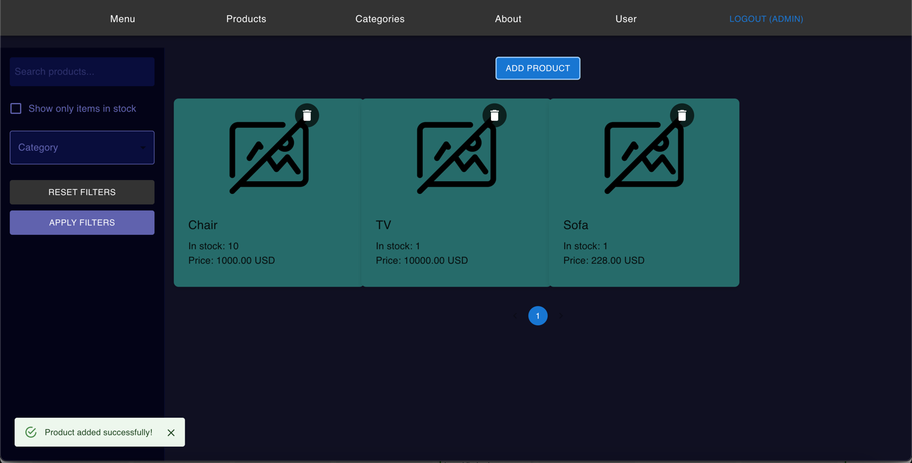
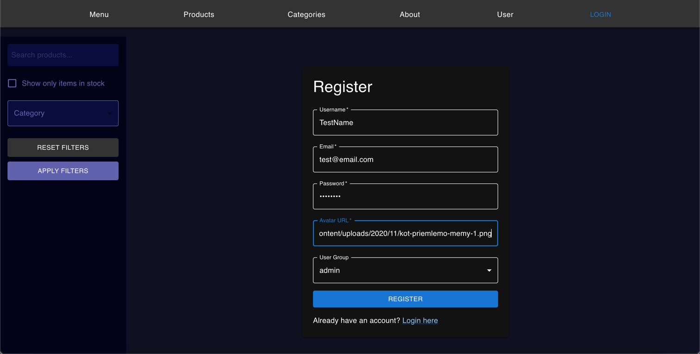
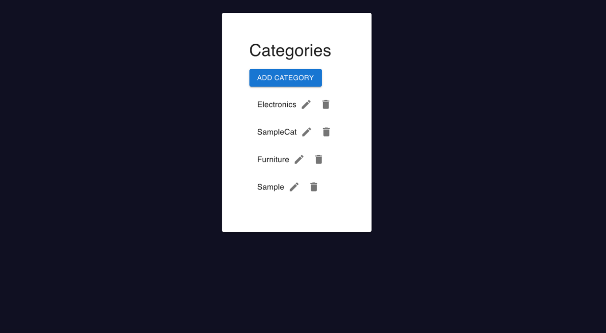
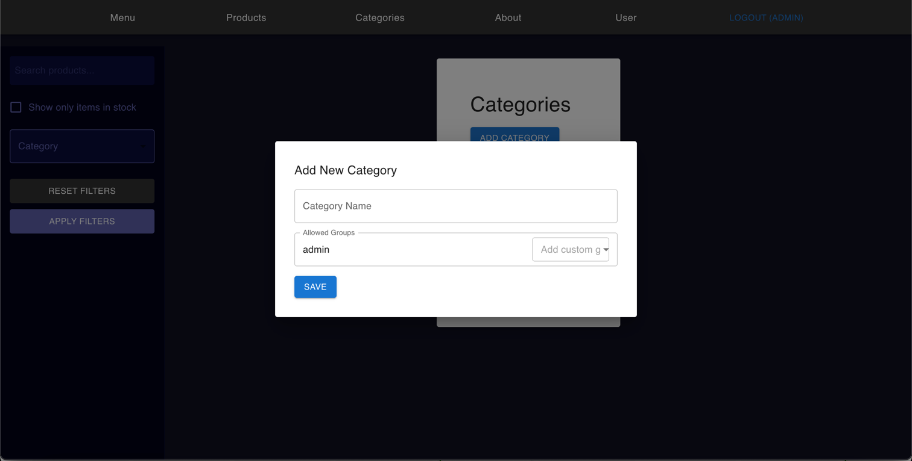
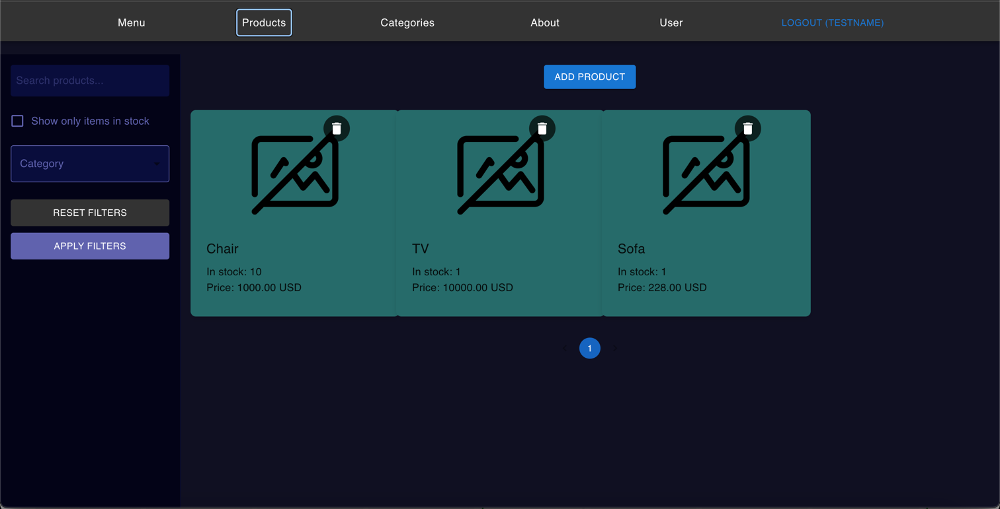
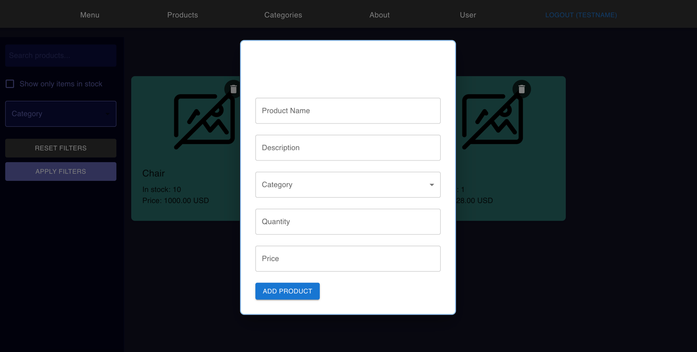
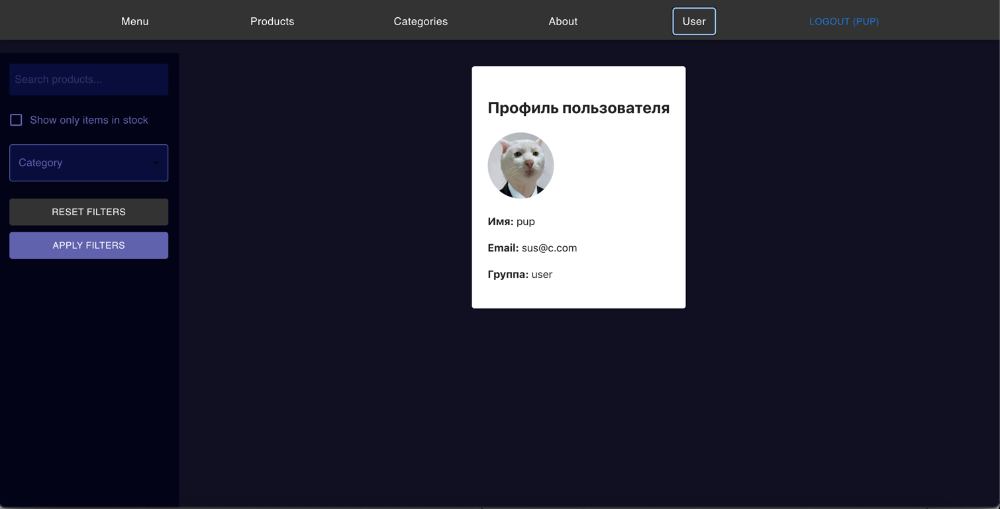

# Product Management System

A full-stack application with role-based access control for managing products and categories.

## Key Features

- **User authentication** (register/login/logout)
- **Role-based permissions** (admin, editor, user)
- **Product management** (create, view, edit, delete)
- **Category management** with group restrictions
- **User profile** with personal information

## Getting Started

### 1. Account Creation

To create an admin account (for demonstration purposes):

1. Navigate to the registration page
2. Fill in your details:
    - Username: `admin`
    - Email: `admin@example.com`
    - Password: `securepassword`
    - Group: Select "custom" and enter `admin`
3. Click "Register"

> **Note**: In a production environment, admin accounts should be created through secure backend processes only.

### 2. Role-Based Access Demonstration

#### Admin Privileges
- Can access all categories and products
- Can create/edit/delete any category
- Can manage user permissions

### 3. Category Management Flow

1. **Admin creates categories**:
    - Specify which user groups can access each category
    - Example: Create "Electronics" category accessible only to "admin" and "editor" groups

2. **Regular user experience**:
    - Only sees categories they have access to
    - Restricted from editing category permissions

### 4. Product Management

All users can:
- View products in accessible categories
- See product details

Privileged users can:
- Create new products in permitted categories
- Edit/delete existing products

### 5. User Profile

- View personal information
- See assigned group/permissions
- Update avatar image

## Technical Highlights

- **Frontend**: React with TypeScript, Material-UI
- **State Management**: Redux Toolkit
- **Authentication**: JWT with refresh tokens
- **Role System**: Granular category-level permissions
- **Responsive Design**: Works on all device sizes
